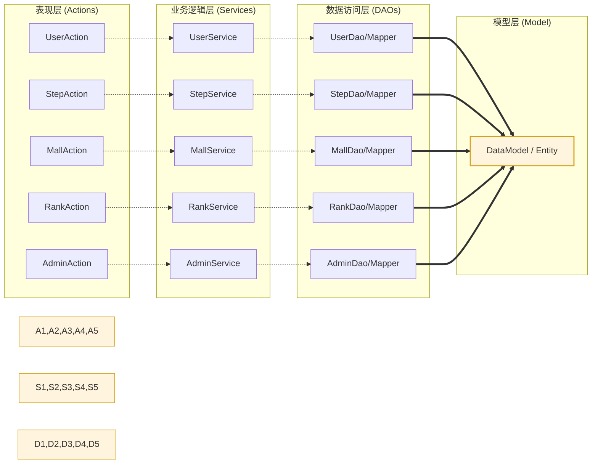

# HSSP 智慧运动步数统计平台 - 系统架构设计说明书 (详细版)

## 1. 引言
*(本文档基于 HSSP 项目实际业务代码与架构重构，用于指导核心功能开发与系统演进。)*

## 2. 项目概述
HSSP (HarmonyOS & Smart Step Platform) 是一个结合鸿蒙原生运动传感器能力、分布式后端存储、实时 Redis 排行榜与积分激励商城的综合运动平台。

## 3. 系统总体架构
本系统采用 Monorepo 模块化架构，核心业务逻辑通过 `hssp-user`、`hssp-mall` 与 `hssp-admin` 进行逻辑隔离。

---

## 4. 关键用例视图

### 4.1 用户体系与身份认证
- **主要参与者**：移动端用户、Web 管理员
- **核心用例**：
    - **账号注册/登录**：基于 JWT 实现移动端与 Web 端的统一认证。
    - **个人信息维护**：用户头像、昵称、安全设置。
    - **Token 鉴权**：系统自动校验请求合法性，保障数据安全。

```mermaid
usecaseDiagram
    actor "前端用户" as User
    package "用户认证模块 (hssp-user)" {
        usecase "账号注册/登录" as UC1
        usecase "JWT 令牌颁发" as UC2
        usecase "个人资料编辑" as UC3
        usecase "权限过滤校验" as UC4
    }
    User --> UC1
    User --> UC2
    User --> UC3
    User --> UC4
```

### 4.2 智能步数统计与上报
- **主要参与者**：移动端用户 (ArkTS)
- **核心用例**：
    - **步数自动上报**：鸿蒙端定时聚合步数并进行加密推送。
    - **历史步数查询**：查看日、周、月维度的运动趋势。
    - **步数核销校验**：确保步数数据在数据库中的新鲜度与唯一性。

```mermaid
usecaseDiagram
    actor "鸿蒙 App 用户" as AppUser
    package "步数统计模块 (hssp-user)" {
        usecase "传感器步数采集" as UC1
        usecase "步数加密上报" as UC2
        usecase "运动周/月报查看" as UC3
        usecase "数据同步核对" as UC4
    }
    AppUser --> UC1
    AppUser --> UC2
    AppUser --> UC3
    AppUser --> UC4
```

### 4.3 积分兑换系统
- **主要参与者**：移动端用户
- **核心用例**：
    - **步数换金算法**：系统根据配置的 1000:1 比例进行换算。
    - **兑换流水记录**：记录每一次步数消耗与积分产生。
    - **每日兑换上限校验**：防止异常数据刷分。

```mermaid
usecaseDiagram
    actor "App 用户" as User
    package "积分兑换模块 (hssp-mall)" {
        usecase "步数核销换分" as UC1
        usecase "积分余额查询" as UC2
        usecase "兑换记录明细" as UC3
        usecase "规则合法性检查" as UC4
    }
    User --> UC1
    User --> UC2
    User --> UC3
    User --> UC4
```

### 4.4 积分商城管理
- **主要参与者**：移动端用户、商城管理员
- **核心用例**：
    - **商品展示与搜索**：支持按类别查看可供兑换的商品。
    - **商品上下架**：管理员配置礼品信息。
    - **积分下单支付**：使用总积分直接购买商品并生成订单。

```mermaid
usecaseDiagram
    actor "用户" as User
    actor "管理员" as Admin
    package "商城管理模块 (hssp-mall)" {
        usecase "商品列表展示" as UC1
        usecase "详情查看" as UC2
        usecase "商品新增/编辑" as UC3
        usecase "积分下单购买" as UC4
        usecase "库存/价格管理" as UC5
    }
    User --> UC1
    User --> UC2
    User --> UC4
    Admin --> UC3
    Admin --> UC5
```

### 4.5 实时运动排行榜系统
- **主要参与者**：全系统用户
- **核心用例**：
    - **实时排行查询**：前端秒级获取日榜、周榜。
    - **异步排名更新**：步数上报后，系统自动更新 Redis ZSet 中的权重。
    - **历史榜单结算**：定期将昨日排名固化至数据库。

```mermaid
usecaseDiagram
    actor "App/Web 用户" as User
    package "排行榜模块 (hssp-user)" {
        usecase "实时日/周榜拉取" as UC1
        usecase "个人排名定位" as UC2
        usecase "Redis 权重动态更新" as UC3
        usecase "榜单历史沉淀" as UC4
    }
    User --> UC1
    User --> UC2
    User --> UC3
    User --> UC4
```

### 4.6 后台系统管控与配置
- **主要参与者**：系统超级管理员
- **核心用例**：
    - **全局规则设定**：通过 `hssp-admin` 修改积分比率、维护公告。
    - **用户状态监控**：对违规批量导入步数的用户进行封禁。
    - **数据导出 Excel**：导出运营相关的用户积分、步数趋势报表。

```mermaid
usecaseDiagram
    actor "超级管理员" as SuperAdmin
    package "管控中心 (hssp-admin)" {
        usecase "兑换规则全局配置" as UC1
        usecase "用户账号停用/启用" as UC2
        usecase "运营数据 Excel 导出" as UC3
        usecase "系统公告下发" as UC4
    }
    SuperAdmin --> UC1
    SuperAdmin --> UC2
    SuperAdmin --> UC3
    SuperAdmin --> UC4
```

---

## 5. 层次结构

本节按照系统逻辑架构定义了各业务模块的层次调用关系。系统遵循 **Action (Controller) -> Service -> DAO (Mapper) -> DataModel** 的标准分层模式，所有持久层模块均依赖于统一的数据模型层。

### 5.1 系统层次结构图 (基于 HSSP 实际业务)



### 5.2 层次结构说明
1.  **Action 层**: 对应项目中的 `Controller`，负责接收请求响应、参数校验及 JWT 权限初步过滤。
2.  **Service 层**: 承载核心业务逻辑（如步数换算算法、DB与Redis联动逻辑）。
3.  **DAO 层**: 即项目中的 `Mapper` 接口，基于 MyBatis-Plus 实现对 MySQL 数据的原子操作。
4.  **DataModel 层**: 对应 `hssp-model` 模块中的 `po` (Persistent Object) 和 `Entity`，是全系统数据的统一承载者。
